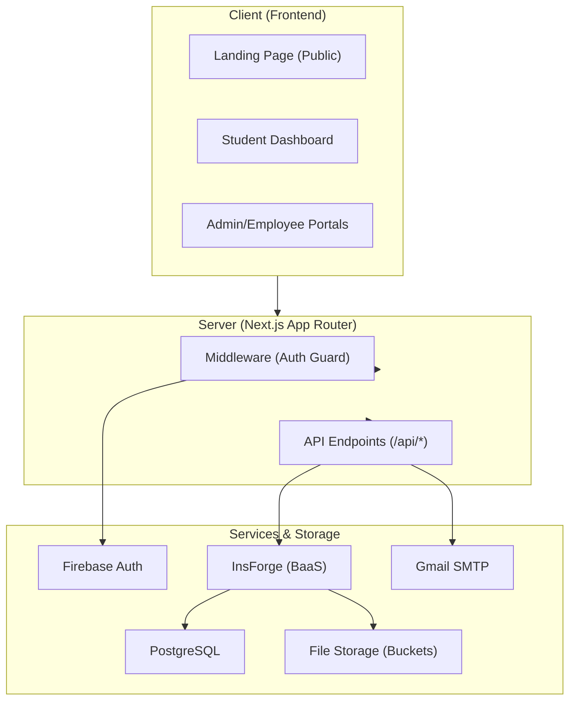

# ⚡ Project Immortal

### Engineering Ideas Into Real Software

Project Immortal is a cutting-edge, full-stack project management platform meticulously crafted for engineering students, administrators, and developers. It bridges the gap between conceptual engineering ideas and production-grade software by providing a collaborative workspace for submitting, tracking, and delivering high-quality projects.

[](https://nextjs.org/)
[](https://react.dev/)
[](https://www.typescriptlang.org/)
[](https://tailwindcss.com/)
[](https://firebase.google.com/)
[](https://insforge.app/)

---

## 📋 Table of Contents
- [Overview](#-overview)
- [Features](#-features)
- [Architecture](#-architecture)
- [Tech Stack](#-tech-stack)
- [Project Structure](#-project-structure)
- [Getting Started](#-getting-started)
- [Environment Variables](#-environment-variables)
- [Role-Based Access](#-role-based-access)
- [Deployment](#-deployment)
- [License](#-license)

---

## 🌟 Overview

**Project Immortal** serves as a centralized hub connecting aspiring student engineers with a professional development team. The platform streamlines the entire project lifecycle — from the initial sparks of a project idea to the delivery of professional documentation and executable code.

### The Three Pillars

| Portal | Intended For | Primary Responsibilities |
| :--- | :--- | :--- |
| 🎓 **Student Portal** | Students & Researchers | Submit ideas, track progress, access deliverables, manage profiles. |
| 🛡️ **Admin Portal** | Team Leads & Admins | Review submissions, user management, scheduling, lifecycle control. |
| 👷 **Employee Portal** | Assigned Engineers | Direct project execution, document uploads, technical management. |

---

## ✨ Key Features

### 🌐 Premium Landing Page
- **Immersive Visuals**: WebGL shader backgrounds and 3D elements powered by **React Three Fiber**.
- **Interactive Sections**: Dynamic service showcasing, marquee-style testimonials, and fluid animations.
- **Project Intake**: Seamless submission forms integrated with backend processing.

### 🎓 Student Experience
- **Real-time Tracker**: A 6-stage visual pipeline (Submitted → Review → Approved → Development → Delivery → Completed).
- **Deliverables Hub**: One-click downloads for Records, PPTs, Viva prep, and internal notes.
- **Meeting Management**: Integrated schedule for virtual and physical project consultations.
- **Profile Customization**: Advanced image cropping for personalized avatars.

### 🛡️ Administrative Command Center
- **Mission Control**: Overview metrics and system health visualizations via **Recharts**.
- **Submission Orchestration**: granular control over approving or rejecting incoming requests.
- **Automated Workflow**: Triggers professional email notifications (via Gmail SMTP) upon submission status changes.
- **Lifecycle Management**: update project stages and upload critical documentation as the project evolves.

### 🛠️ Developer (Employee) Workspace
- **Focused Execution**: Isolated workspace for managing assigned project documentation.
- **Storage Integration**: Direct hooks into **InsForge Storage** for blazing-fast file uploads and management.

---

## 🏗️ Architecture

Project Immortal uses a modern, high-performance architecture centered around **Next.js 16** and the **InsForge** ecosystem.



---

## 🛠️ Tech Stack

### Frontend & UI
- **Core**: Next.js 16 (App Router), React 19.
- **Styling**: Tailwind CSS 4.0, Framer Motion for micro-animations.
- **3D/Graphics**: Three.js, React Three Fiber, custom WebGL shaders.
- **Components**: Shadcn/UI, Radix UI primitives, Lucide React icons.
- **Charts**: Recharts for data-driven analytics.

### Backend & Infrastructure
- **BaaS**: [InsForge SDK](https://insforge.app/) (Database, Storage, Serverless).
- **Authentication**: Firebase Authentication (Admin/Employee), Session Cookies (Student).
- **Email**: Nodemailer with Gmail SMTP.
- **Database**: PostgreSQL (via InsForge API).

---

## 📁 Project Structure

```text
├── src/
│   ├── app/                # Next.js App Router (Pages & API Routes)
│   │   ├── admin/          # Multi-view Admin Portal
│   │   ├── student/        # Student-specific dashboard
│   │   ├── employee/       # Developer workspace
│   │   └── api/            # Server-side logic & integrations
│   ├── components/
│   │   ├── ui/             # Shadcn & bespoke UI components
│   │   └── sections/       # Landing page building blocks
│   ├── lib/                # Shared utilities & SDK clients
│   └── types/              # Collective TypeScript definitions
├── public/                 # Static assets & brand media
└── .env.example            # Deployment environment template
```

---

## 🚀 Getting Started

### Prerequisites
- **Node.js**: 18.0 or higher.
- **Package Manager**: npm (v9+ recommended).
- **Accounts Required**: Firebase (Auth), InsForge (Project), Gmail (SMTP for notifications).

### Installation

1.  **Clone the Repository**
    ```bash
    git clone https://github.com/YOUR_USERNAME/Project-Immortal.git
    cd Project-Immortal
    ```

2.  **Install Dependencies**
    ```bash
    npm install
    ```

3.  **Configure Environment**
    Create a `.env.local` file in the root directory:
    ```bash
    cp .env.example .env.local
    # Open .env.local and fill in your specific keys
    ```

4.  **Run Development Server**
    ```bash
    npm run dev
    ```

5.  **Access the Platform**
    Site: `http://localhost:3000`

---

## 🔐 Environment Variables

| Variable | Description |
| :--- | :--- |
| `NEXT_PUBLIC_INSFORGE_URL` | Your InsForge backend instance endpoint. |
| `NEXT_PUBLIC_INSFORGE_ANON_KEY` | Anonymous key for public database access. |
| `ADMIN_EMAILS` | Comma-separated list of whitelisted admin emails. |
| `EMAIL_USER` / `EMAIL_PASS` | Config for Nodemailer (Gmail App Password). |
| `NEXT_PUBLIC_FIREBASE_*` | Firebase project credentials (API Key, Project ID, etc.). |

---

## 👥 Role-Based Access

| Role | Auth Method | Capabilities |
| :--- | :--- | :--- |
| **Public** | None | Browse site, submit projects |
| **Student** | Email + Order ID | View dashboard, track progress, download docs |
| **Employee** | DB Auth | Manage assigned project documents |
| **Admin** | Firebase Auth | Full platform control & analytics |

---

## 🚢 Deployment

Project Immortal is optimized for one-click deployment on **Vercel**:

1. Push your code to GitHub.
2. Link your repository in the Vercel dashboard.
3. Import your `.env.local` variables into the Vercel project settings.
4. Deploy!

---

## 📄 License

This software is **proprietary** and developed by the **Project Immortal Engineering Team**. Unauthorized redistribution or modification is strictly prohibited.

---

<div align="center">
  <p>Built with ❤️ from Guntur, Andhra Pradesh, India</p>
</div>
